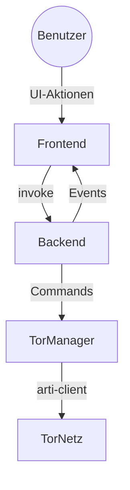
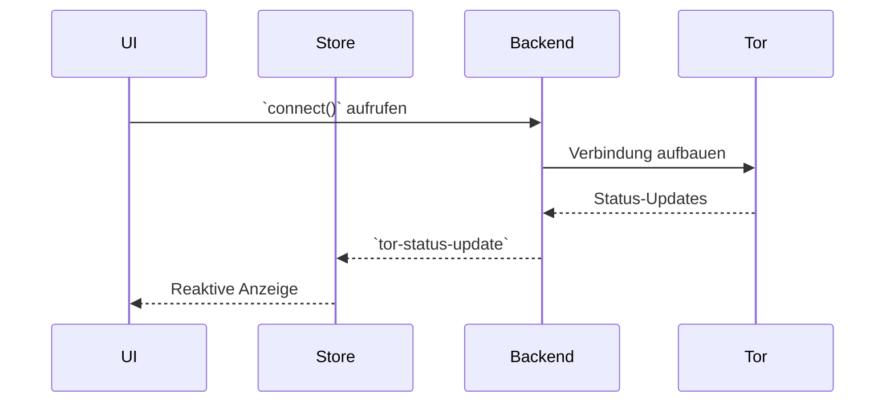

# Torwell84 V2 - Documentation

## 1. Architecture

Torwell84 V2 is a complete rewrite focusing on a clean, modern, and maintainable architecture. The legacy Go backend and all associated code have been entirely discarded.

The new architecture is unified and consists of the following components:

-   **Frontend:** A SvelteKit single-page application responsible for the entire user interface. It is located in the `/` directory of the V2 project.
-   **Backend (Core):** A single, modular Rust crate located in `/src-tauri`. This crate is directly integrated with the Tauri runtime and serves as the application's core logic. There is no separate backend process.
-   **Communication:** The frontend and backend communicate exclusively and efficiently through Tauri's built-in IPC (Inter-Process Communication) system, using Tauri commands (`invoke`) and events (`listen`). This eliminates the need for any local web server, gRPC, or other network protocols between the frontend and backend.

## 2. Core Components

### 2.1. Rust Backend (`/src-tauri`)

The backend is structured into several logical modules:

-   **`main.rs` & `lib.rs`:** The entry points for the Tauri application, responsible for initializing the builder, managing the application state, and registering commands.
-   **`state.rs`:** Defines the shared `AppState`, which holds the `TorManager` instance and log storage, ensuring a single, consistent state for the Tor client across the application.
-   **`tor_manager.rs`:** A dedicated, robust module that encapsulates all interactions with the `arti-client` library. It handles the lifecycle of the Tor client, including connection, disconnection, circuit management (`get_active_circuit`), and requesting a new identity (`new_identity`).
-   **`commands.rs`:** Implements all Tauri commands that are exposed to the Svelte frontend. These functions act as thin, clean wrappers, delegating all business logic to the `TorManager`. This ensures a clear separation of concerns.
-   **`error.rs`:** Defines a custom, serializable `Error` enum for the entire backend. In addition to `NotConnected` and `AlreadyConnected`, it exposes variants for bootstrap failures, directory lookups, circuit building issues and identity refresh problems. These descriptive errors are serialized and sent to the frontend for user-friendly reporting.

### 2.2. Svelte Frontend (`/src`)

The frontend remains visually and functionally identical to the original design, as per the requirements.

-   **State Management:**
    -   `torStore.ts`: A Svelte store that subscribes to backend events (`tor-status-update`) to reactively display the current Tor connection status, bootstrap progress, and errors.
    -   `uiStore.ts`: A Svelte store for managing the state of the UI, such as open modals. It also handles client-side settings persistence using `Dexie.js`.
-   **Components:** All UI components from the original version are reused without modification to their appearance. The logic within them now communicates with the robust and fully implemented Rust backend via Tauri's `invoke` API. Mock data and placeholders have been removed.

## 3. New Features in V2.1

### 3.1 New Identity Functionality
- Added ability to request new Tor circuits via `new_identity` command
- Full integration with frontend UI using dedicated button
- Uses arti-client's `reconfigure` and `retire_all_circs` for identity refresh

### 3.2 Logging System
- Centralized log storage in AppState with thread-safe access
- Automatic log rotation (max 1000 entries)
- Commands for log retrieval and clearing
- Logs are stored as JSON lines containing the log level, timestamp and message
- The Logs modal in the Svelte UI lets users filter by level and highlights
  warnings and errors with dedicated colours

### 3.3 Documentation Updates
- Comprehensive changelog tracking
- Task list for future improvements

### 3.4 Hardware Security Module
Support for PKCS#11 modules is available when compiling with the `hsm` feature.
`SecureHttpClient` loads the library specified by the `TORWELL_HSM_LIB`
environment variable and can access keys on a hardware token.

### 3.5 Circuit Management
The command `build_new_circuit` allows creating additional circuits on demand.
`circuit_metrics` returns the number of currently open circuits and the age of
the oldest one when compiled with the `experimental-api` feature (pass
`--features experimental-api` or use `task build`).

### 3.6 Mobile Workflow
Running `task mobile:android` or `task mobile:ios` builds a Capacitor-based
mobile shell. The backend runs a small HTTP bridge on port 1421 when compiled
with the `mobile` feature so that the web app can control the Tor client.

### 3.7 Metrics Retrieval Limit
The `load_metrics` command now accepts an optional `limit` parameter to
restrict the number of entries returned. If no limit is provided, the backend
returns the most recent 100 metric points. Frontend components pass their
desired limit to fetch only the data required for their charts. A valid
session token is required for this command, aligning it with the
authentication model used by other API endpoints.

## 4. Build Process

The application is built as a standard Tauri project:

1.  The SvelteKit frontend is built into a set of static assets (HTML, CSS, JS).
2.  The Rust backend is compiled into a binary.
3.  The Tauri bundler packages the frontend assets and the Rust binary into a single, native executable for the target platform (e.g., `.app` for macOS, `.exe` for Windows).

## 5. Error States

Errors from the backend are emitted through the `tor-status-update` event. The main variants are:

- `NotConnected` – a command requiring an active Tor connection was invoked while disconnected.
- `AlreadyConnected` – a connection was attempted when one already exists.
- `Bootstrap` – the Tor client failed to bootstrap.
- `NetDir` – the network directory could not be retrieved.
- `Circuit` – building or retrieving a circuit failed.
- `Identity` – refreshing the Tor identity was unsuccessful.

The serialized error message is provided in the event's `errorMessage` field so the frontend can display user-friendly feedback.

## 6. Traffic Statistics

Version 2.2 introduces live traffic counters. `TorManager` exposes the total bytes
sent and received via `traffic_stats()`, and the `get_traffic_stats` Tauri command
passes these values to the frontend. The main status card now periodically
displays the aggregate traffic in megabytes.

## 7. Bootstrap Progress

`TorManager::connect_once` streams bootstrap events from `arti-client` and
invokes a progress callback with the current percentage. The `connect` command
forwards these values through `tor-status-update` events so the frontend can
render a live progress bar. `torStore.ts` listens for the events to keep its
`bootstrapProgress` state updated, and `IdlePanel.svelte` displays this value to
give users visual feedback during connection.

## 8. Bridge Configuration and Circuit Isolation

- `TorManager` accepts a list of bridge lines which are applied to the `TorClientConfig` when connecting.
- The command `set_bridges` stores user-provided bridges so that censored networks can reach the Tor network.
- `get_isolated_circuit` manages multiple isolation tokens per domain, allowing several parallel circuits to the same hostname.
- The settings modal in the Svelte UI offers a simple list of bridges the user can enable or disable.

## 9. Accessibility Strategy

Torwell84 adheres to WCAG 2.1 AA where possible. All interactive controls now include meaningful `aria-label` attributes, and modal dialogs shift keyboard focus to their close buttons upon opening. Text colors were updated to maintain sufficient contrast against the dark interface. These improvements help screen reader users and enable consistent keyboard navigation.

## 10. Accessibility Implementation

All buttons and form controls declare `aria-label` values so assistive technologies can accurately describe their purpose. When a modal becomes visible, the close button receives focus using Svelte's `tick` helper, enabling keyboard users to dismiss dialogs without hunting for focus. Text colours across the UI were lightened to improve contrast against the dark theme, meeting WCAG AA requirements.

## 11. Architekturdiagramme

Die folgende Mermaid-Grafik zeigt die grobe Struktur von Torwell84 V2. Der SvelteKit-Frontendcode läuft innerhalb der Tauri-Shell und kommuniziert ausschließlich über IPC mit dem Rust-Backend.



## 12. Datenfluss

Der typische Ablauf einer Verbindung sieht wie folgt aus:



## 13. Environment Variables

Das Backend akzeptiert verschiedene Umgebungsvariablen zur Laufzeitkonfiguration.

- `TORWELL_CERT_URL` – HTTPS-Endpunkt zum Abrufen des Serverzertifikats.
- `TORWELL_CERT_PATH` – Lokaler Pfad zum abgelegten Zertifikat.
- `TORWELL_FALLBACK_CERT_URL` – Optionale Ausweich-URL für Zertifikatsupdates.
- `TORWELL_SESSION_TTL` – Lebensdauer eines Session-Tokens in Sekunden (Standard `3600`).
- `TORWELL_MAX_LOG_LINES` – Maximale Anzahl von Logzeilen, die in `torwell.log` aufbewahrt werden (Standard `1000`).
- `TORWELL_MAX_MEMORY_MB` – Schwellenwert für Speichernutzung, ab dem Warnungen ausgegeben werden (Standard `1024`).
- `TORWELL_MAX_CIRCUITS` – Maximale Anzahl erlaubter paralleler Tor-Circuits (Standard `20`).
- `TORWELL_METRICS_FILE` – Pfad für aufgezeichnete Metrikpunkte (Standard `metrics.json`).
- `TORWELL_MAX_METRIC_LINES` – Maximale Zeilenanzahl der Metrikdatei (Standard `10000`).
- `TORWELL_MAX_METRIC_MB` – Maximale Dateigröße in MB (Standard `5`).
- `TORWELL_METRIC_INTERVAL` – Intervall der Metrikerfassung in Sekunden (Standard `30`).
- `TORWELL_LOG_ENDPOINT` – Optionaler HTTP-Endpunkt zum Weiterleiten von Logeinträgen.
- Bei Überschreitung dieser Limits erscheint ein Warnhinweis im Systemtray-Menü.


## 14. Session Tokens

Bestimmte Befehle wie `get_logs` oder `ping_host` benötigen ein gültiges Session-Token. Dieses lässt sich mit dem Kommando `request_token` abrufen und muss danach bei jedem Aufruf als `token`-Argument übergeben werden.

```ts
import { invoke } from '@tauri-apps/api/tauri';

async function fetchLogs() {
  const tok = await invoke<string>('request_token');
  return invoke('get_logs', { token: tok });
}
```

Die Tokens verfallen nach der in `TORWELL_SESSION_TTL` definierten Zeitspanne. Erhält der Client einen `401`-Fehler oder eine Meldung "Invalid session token", sollte umgehend ein neues Token angefordert und der Befehl erneut ausgeführt werden.

## 15. UI Backup

Vor Experimenten mit neuen Layouts kann die aktuelle Benutzeroberfläche
gesichert werden. Das Skript `scripts/backup_ui.sh` kopiert dazu den Inhalt von
`src/lib/components` in das Verzeichnis `src/lib/components_backup` und legt es
bei Bedarf an. Dieser Ordner ist in `.gitignore` eingetragen und wird nicht ins
Repository übernommen.

