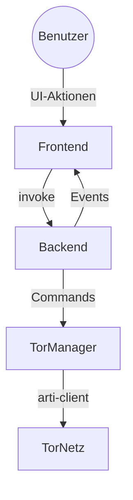
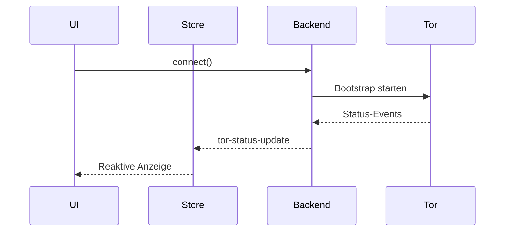

# Torwell84 V2 — Documentation Hub

Willkommen im zentralen Einstiegspunkt für Code, Prozesse und Sicherheitsartefakte von Torwell84. Diese Seite verlinkt alle relevanten Dokumente, fasst Kernflüsse zusammen und beschreibt aktuelle Qualitäts-Gates.

## Quick Links
- [Spec (Zielzustand)](./spec.md)
- [Plan / Roadmap](./plan.md)
- [TODO-Übersicht](./todo.md) & [CR-Backlog](./todo/)
- [File & Wire Map](./FILEANDWIREMAP.md)
- [Security Audit Plan](./SecurityAuditPlan.md), [PenTest Plan](./PenTestPlan.md)
- [Changelog](./Changelog.md), [Context](./context.md)

## 1. Onboarding & Highlights
- **UI & Motion:** Premiumisierte Glass-UI mit GPU-beschleunigten Blur-Layern, `prefers-reduced-motion` Support und Serialisierung der Connect/Disconnect-Flows.
- **Resilienz:** `torStore` kapselt Event-Lifecycle, `invokeWithRetry` nutzt exponentielles Backoff & Jitter, TorManager behandelt Mehrfach-Connect idempotent.
- **Security:** Guardrails für Bridge- und Circuit-Konfiguration, GeoIP/HSM-Dokumentation, aktualisierte Audit- und PenTest-Pläne.
- **Docs:** Vollständige `/docs`-Struktur mit Spezifikation, Roadmap, Threat-Model und zentralem Hub.

## 2. Build, Run & Developer Experience
| Ziel | Kommando | Beschreibung |
|------|----------|--------------|
| Development Session | `scripts/utils/dev_run.sh` | Startet `bun run tauri:dev`, forwardet zusätzliche CLI-Argumente (z. B. `-- --fullscreen`). |
| Frontend Build | `bun run build` | SvelteKit Build inkl. Tailwind/PostCSS. |
| Backend Build | `cargo build --locked` (im `src-tauri` Ordner) | Erstellt das Tauri-Rust-Binary. |
| Release Bundle | `task build` oder `bun run tauri:build` | Plattformabhängiges Packaging. |

### Dependencies
- Bun ≥1.1, Node.js ≥20, Rust ≥1.77, Cargo.
- Systemlibs: `pkg-config`, `glib-2.0`, `openssl` (für Tauri/Linux).
- Für Benchmarks optional: `vitest` (über Bun installiert), `hyperfine` für externe Messungen.

## 3. Tests & Qualitäts-Gates
Nutze das zentrale Script `scripts/tests/run_all.sh` (siehe Abschnitt 8 für Details zu CI-Hooks).

```bash
scripts/tests/run_all.sh            # vollständiger Lauf
scripts/tests/run_all.sh -- --test tor_manager::connect_idempotent
```

Das Skript führt sequentiell aus:
1. `bun run check` — Typen- & A11y-Checks.
2. `bun run test` — Vitest-Unit- und Integrationstests.
3. `cargo test --locked` im `src-tauri`-Crate.

Fehlschläge werden sofort gemeldet (Exit-Code ≠ 0). Für Umgebungen ohne die benötigten Systembibliotheken dokumentiert `docs/plan.md` entsprechende CI-Hooks.

## 4. Benchmarks
`scripts/benchmarks/run_frontend_benchmarks.sh` nutzt `bun x vitest bench` für UI-Mikrobenchmarks (z. B. Store-Reducer, Layout-Berechnungen). Weitere Benchmarks können in diesem Ordner ergänzt werden.

```bash
scripts/benchmarks/run_frontend_benchmarks.sh -- --runInBand
```

Ergebnisse sollten p50/p95/p99-Latenzen im Terminal anzeigen. Integration mit `hyperfine` oder `cargo bench` folgt nach Definition konkreter Metriken (siehe Spec).

## 5. Architektur-Überblick


### Komponenten
- **Frontend (`/src`):** SvelteKit SPA mit State Stores (`torStore.ts`, `uiStore.ts`), Komponenten wie `StatusCard.svelte`, `ActionCard.svelte`, `IdlePanel.svelte`. Nutzt Dexie für persistente Einstellungen.
- **Backend (`/src-tauri`):** Rust-Crate mit `TorManager` (arti-Integration), `state.rs` (AppState, Log-Puffer), Tauri Commands (`commands.rs`), Fehlerenum (`error.rs`).
- **IPC Layer:** Tauri `invoke/listen` Events (`tor-status-update`, `metrics-update`, `log-update`).
- **Tooling:** Taskfile, Scripts in `/scripts`, Tests im Frontend (Vitest) & Backend (Cargo).

### Datenfluss (Connect)


## 6. Threat Model (STRIDE)
| Komponente | Spoofing | Tampering | Repudiation | Information Disclosure | Denial of Service | Elevation of Privilege | Gegenmaßnahmen |
|------------|----------|-----------|-------------|------------------------|-------------------|------------------------|-----------------|
| Frontend IPC | Tauri-Events könnten gefälscht werden | Manipulierte Payloads | Fehlende Audit-Trails | Sensible Metriken | Event-Flooding | Unautorisierte Command-Aufrufe | Nur signierte Bundles, Payload-Validation, Rate-Limits & Logging |
| TorManager | Gefälschte Config-Dateien | Veränderte Bridge/Policy-Einstellungen | Command-Audit fehlt | Logs/Secrets | Ressourcenbindung während Bootstrap | Ausweitung von Befehlsrechten | Signiertes Config-Laden, Checksums, Idempotente Commands, strukturierte Logs |
| Persistente Stores | Session-Token-Spoofing | Dexie-Datenbank manipuliert | Datenzugriffe schwer nachvollziehbar | Speicherung sensibler Tokens | Korruptes Storage führt zu Fehlstarts | Manipulierte Einstellungen ändern Privilegien | Encryption at Rest (optional), Integritätsprüfungen, Reset-Routinen |
| Scripts & Tooling | Malicious PATH-Injektion | Skriptänderungen | Fehlende Logs | Secrets in Env | Tests blockieren Pipeline | Skript mit SUID? | `set -euo pipefail`, Checks für benötigte Binaries, signierte CI-Hooks |
| CI/CD | Gefälschte Runner | Artefaktmanipulation | Lückenhafte Logs | Credentials im Klartext | Ressourcenverbrauch | Rechteausweitung durch Runner | Isolierte Runner, Secrets-Scanning, Mandatory Review |

Weitere Details siehe [SecurityAuditPlan](./SecurityAuditPlan.md) & [PenTestPlan](./PenTestPlan.md).

## 7. Operations, Observability & SLAs
- Bootstrap-Events mindestens alle 250 ms, Fehleranzeige ≤500 ms.
- Metrik-Burst limitiert auf 720 Punkte (~2 h @10 s Intervall).
- Logs rotieren nach 1000 Einträgen, Export via `get_logs` Command.
- Environment-Variablen siehe Abschnitt 9.
- Monitoring-Empfehlung: Telemetriedaten (Bootstrap-Progress, Circuit-Anzahl, Traffic) aggregieren und Alerts auf p95 > 5 s setzen.

## 8. CI/Lint Hooks & Automatisierung
- `scripts/tests/run_all.sh` ist der zentrale CI-Einstieg. In `docs/plan.md` sind Schritte zur Integration in GitHub Actions (Bun Setup, Rust Cache, Linux Dependencies) dokumentiert.
- Pre-commit Hooks empfohlen: `bun run check`, `bun run test --run tests/unit`, `cargo fmt -- --check`, `cargo clippy -- -D warnings` (letzteres als Follow-up zu implementieren).
- Geplante Erweiterung: automatischer Upload der Vitest-Bench-Ergebnisse als Build-Artefakt.

## 9. Deployment & Environment Variables
- `TORWELL_CERT_URL`, `TORWELL_CERT_PATH`, `TORWELL_FALLBACK_CERT_URL` — Zertifikatsverwaltung.
- `TORWELL_SESSION_TTL`, `TORWELL_MAX_LOG_LINES`, `TORWELL_MAX_MEMORY_MB`, `TORWELL_MAX_CIRCUITS` — Laufzeit-Governance.
- `TORWELL_METRICS_FILE`, `TORWELL_MAX_METRIC_LINES`, `TORWELL_MAX_METRIC_MB`, `TORWELL_METRIC_INTERVAL` — Telemetrie-Konfiguration.
- `TORWELL_LOG_ENDPOINT` — Externes Log-Forwarding.
- Mobile Feature: HTTP-Bridge auf Port 1421 (`mobile` Feature-Flag), Build via `task mobile:*`.

## 10. Weiterführende Ressourcen
- [ExistingTests](./ExistingTests.md) — Überblick aktueller Testsuiten.
- [ProductionDeployment](./ProductionDeployment.md) — Bereitstellungsleitfaden.
- [Troubleshooting](./TROUBLESHOOTING.md) — Common Issues.
- [GlassUI](./GlassUI.md) & [Mobile](./Mobile.md) — UI/UX Details.
- [HSM](./HSM.md) & [CertificateManagement](./CertificateManagement.md) — Security-spezifische Leitfäden.

## 11. Änderungslog & Governance
- Versionsstand siehe [Changelog](./Changelog.md).
- Neue Aufgaben als CR-Dateien in `docs/todo/` anlegen, anschließend in `docs/todo.md` listen und im nächsten Docs-Sync in diese Datei zurückführen.

Bleibt das Dokument konsistent? Prüfe im Zweifel die Spec und aktualisiere bei Architektur- oder Security-Relevanten Änderungen.
