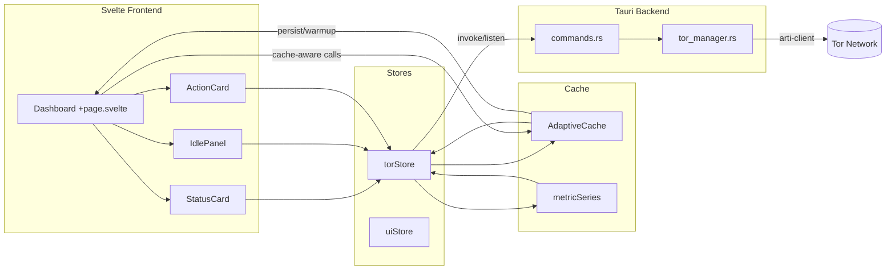

# File & Wire Map

```text
src/
  app.css                  # Globale Themes, Glas-Token, Motion-Keyframes
  cache/
    adaptiveCache.ts       # Konfigurierbarer Cache (LRU/LFU/FIFO, TTL, Warmup)
    index.ts               # Cache-Instanzen (Timeline, Summary, Geo), Persistenz
    metricSeries.ts        # Struct-of-Arrays für Metrikberechnungen
  lib/
    api.ts                 # Invoke-Wrapper mit Token/Retries + Cache-Hits
    stores/
      torStore.ts          # Status/Metriken, Event-Lifecycle
    components/
      StatusCard.svelte    # Hauptstatus mit Circuit/Route Visualisierung
      IdlePanel.svelte     # Bootstrap-Progress & Retry-State
      ActionCard.svelte    # Connect/Disconnect Controls
  routes/
    +page.svelte           # Dashboard Layout (Sections, Modals)

src-tauri/
  src/
    tor_manager.rs         # Arti Integration, Circuit Policies, Backoff
    commands.rs            # Tauri Commands & Rate-Limits
    lib.rs                 # Tauri-Setup, globaler mimalloc Allocator

scripts/
  benchmarks/
    run_massif.sh          # Valgrind Massif Runner (Memory Profiling)
    run_heaptrack.sh       # Heaptrack Runner (Allocation Tracing)

docs/
  DOCUMENTATION.md         # Hub, Überblick
  spec.md                  # Zielzustand & SLAs
  plan.md                  # WBS & Priorisierung
  todo.md                  # Offene Arbeiten & Backlog
  ReleaseNotes.md          # Versionshinweise v2.5
  archive/CR-0001.md       # Historisches CR-Blatt (Diagnostics Follow-up)

scripts/
  benchmarks/
    connection_startup.sh  # Bootstrap-Benchmark (p50/p95/p99)
  backup_ui.sh             # Sicherung der UI-Komponenten
```


